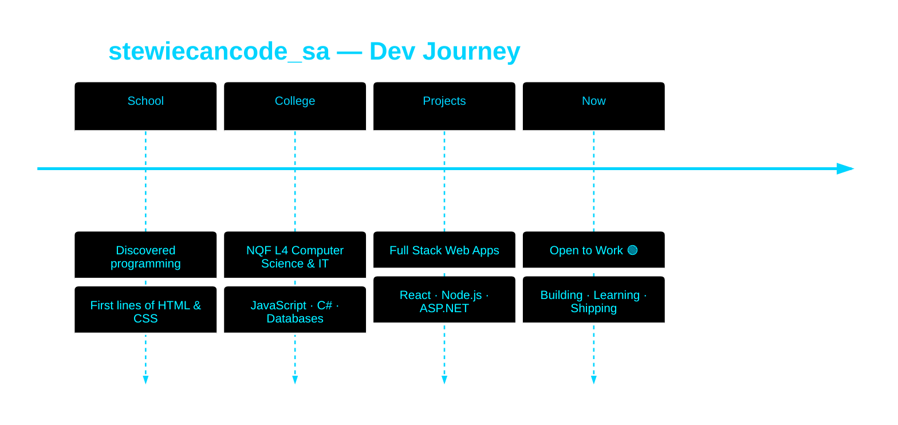

<!-- Animated Wave Header -->
<div align="center">
  
</div>

<!-- Animated Typing -->
<div align="center">
  
</div>

<br>

<!-- Social Badges -->
<p align="center">
  <a href="mailto:tshireletsoselemela17@gmail.com"></a>
  <a href="https://www.linkedin.com/in/tshireletso-selemela-00a283253/"></a>
  <a href="https://instagram.com/stewiecancode_sa"></a>
  <a href="https://tiktok.com/@stewiecancode_sa"></a>
  <br><br>
  <!-- WORKING visitor counter via visitorbadge.io -->
  
</p>

<br>

<!-- Animated Contribution Snake -->
<div align="center">
  <picture>
    <source media="(prefers-color-scheme: dark)" srcset="https://raw.githubusercontent.com/platane/platane/output/github-contribution-grid-snake-dark.svg">
    <source media="(prefers-color-scheme: light)" srcset="https://raw.githubusercontent.com/platane/platane/output/github-contribution-grid-snake.svg">
    
  </picture>
</div>


<br>

<!-- About Section -->
<table width="100%">
<tr>
<td width="55%" valign="top">

##  ABOUT ME

```typescript
const tshireletso = {
  alias:      "stewiecancode_sa",
  location:   "South Africa 🇿🇦",
  education:  "NQF L4 — CS & Information Technology",

  stack: {
    languages:  ["JavaScript", "TypeScript", "C#"],
    frontend:   ["React", "React Native", "Tailwind CSS"],
    backend:    ["Node.js", "Express", "ASP.NET MVC"],
    databases:  ["MSSQL", "MySQL", "Firebase", "Supabase"],
    cloud:      ["AWS ☁️", "Vercel", "DynamoDB"],
    tools:      ["GitHub", "Power BI", "Blazor", "JWT"]
  },

  currentFocus: [
    "🚀 Building full-stack web apps",
    "📱 Cross-platform mobile development",
    "☁️  Cloud & serverless architecture",
    "🎬 Video editing & UI design"
  ],

  status: "🟢 Open to collaborations & opportunities"
};
```

</td>
<td width="45%" valign="top" align="center">

<br>

<!-- Coding GIF — stable URL -->


<br><br>

###  QUICK FACTS

```
🎓  NQF L4 CS & IT Graduate
💻  Full Stack Developer
🌐  Web + Mobile + Cloud
🎬  Video Editor & Designer
🇿🇦  South Africa | Open to Remote
🟢  Available for collaborations
```

</td>
</tr>
</table>

<br>


<!-- Tech Stack -->
<div align="center">

##  TECH ARSENAL

<!-- Row 1: Skill Icons (confirmed working) -->
<p align="center">
  <a href="https://skillicons.dev">
    
  </a>
</p>

<br>

<!-- Row 2: Devicons via jsdelivr CDN (pure SVG, always renders) -->
<p align="center">
  &nbsp;&nbsp;
  &nbsp;&nbsp;
  &nbsp;&nbsp;
  &nbsp;&nbsp;
  &nbsp;&nbsp;
  &nbsp;&nbsp;
  &nbsp;&nbsp;
  &nbsp;&nbsp;
  &nbsp;&nbsp;
  &nbsp;&nbsp;
  &nbsp;&nbsp;
  
</p>

</div>


<!-- GitHub Stats -->
<div align="center">

##  GITHUB ANALYTICS

<table width="100%">
<tr>
<td width="50%">

</td>
<td width="50%">

</td>
</tr>
</table>

<br>


<br>

<table width="100%">
<tr>
<td width="50%">

</td>
<td width="50%">

</td>
</tr>
</table>

</div>


<!-- What I Bring -->
<div align="center">

##  WHAT I BRING

<table>
<tr>
<td align="center" width="25%">
<br>
<b>Full Stack</b><br>
<sub>Front + Back + DB</sub>
</td>
<td align="center" width="25%">
<br>
<b>Web + Mobile</b><br>
<sub>React & React Native</sub>
</td>
<td align="center" width="25%">
<br>
<b>Cloud Ready</b><br>
<sub>AWS · Vercel · Firebase</sub>
</td>
<td align="center" width="25%">
<br>
<b>5+ Databases</b><br>
<sub>SQL · NoSQL · Realtime</sub>
</td>
</tr>
</table>

</div>


<!-- Career Timeline -->
<div align="center">

##  MY JOURNEY



</div>


<!-- Footer CTA -->
<div align="center">

##  LET'S BUILD SOMETHING


<br>

<a href="mailto:tshireletsoselemela17@gmail.com">
  
</a>
<a href="https://www.linkedin.com/in/tshireletso-selemela-00a283253/">
  
</a>
<a href="https://github.com/tshire-13">
  
</a>

<br><br>


<br>

<sub>⚡ <b>From South Africa to the World — One Commit at a Time</b> ⚡</sub>

<br><br>

<!-- WORKING visit counter — increments on every page load -->


</div>

<!-- Animated Wave Footer -->

